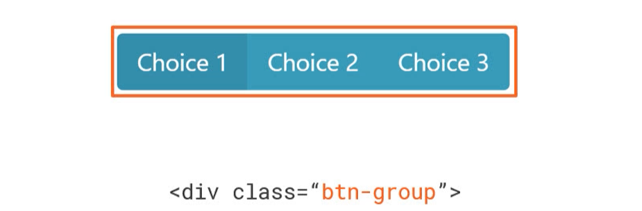
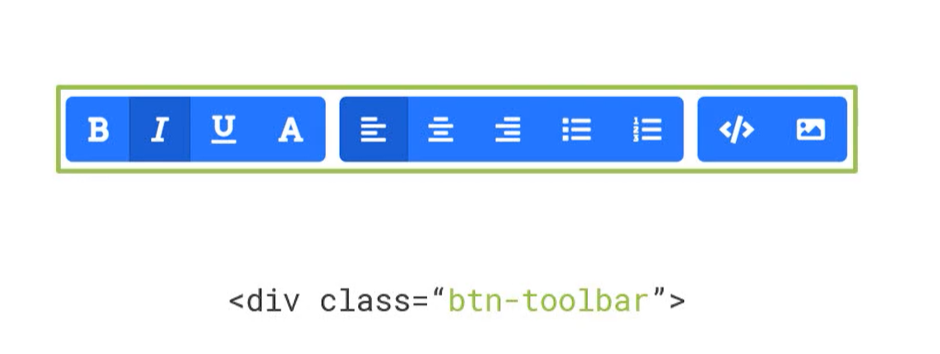
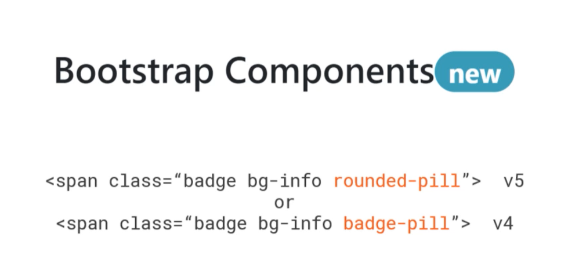
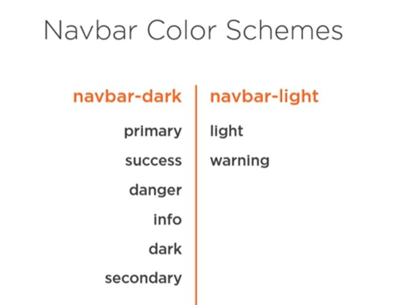
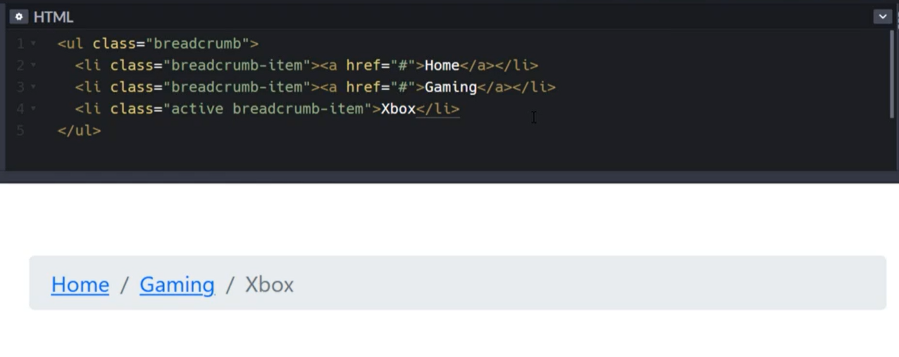
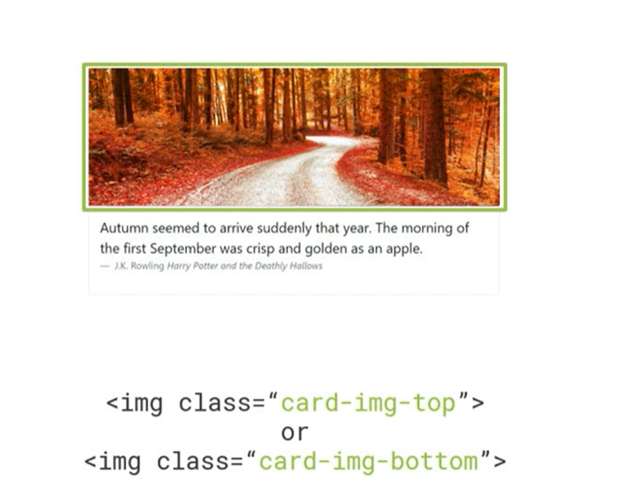
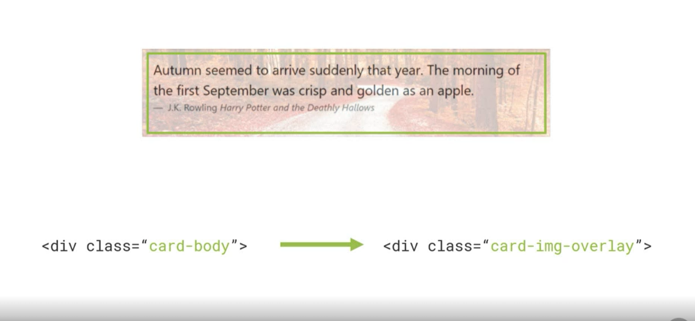

## Color
### Text & Background color
Two main utility classes are used in these cases. <br>
To have color words of a different color in a paragraph, use the span tag with an appropriate tag.<br>
For instance: <br>
```
<span class="text-danger">
<span class="bg-warning">
```

### Border color
Example: <br>
```
<span class="border border-warning">
```

### Component Color
To find an entire div with color, use the alert class. <br>
Example:<br>
```
<div class="alert alert-success">
```

Components with specific color classes:
- Alerts
- Buttons

### Hidden colors
Custom properties or css variable have 2 dashes before their names. Like --bs-pink
```
.customBackground {
    background: var(--bs-pink);
}
```
### Customize Color
To edit or add new colors, one can edit the _variables.scss file. <br>
The Sass file will be compiled and will generate appropriate css in our bootstrap files.

## Buttons
### Button Groups
One can use a button group to create a choice feature. Can be vertical (btn-group-vertical is used) or horizontal (default)



To add several button groups together, use a button toolbar (btn-toolbar)



## Badges


## List Groups
These can used inside <b>ul, ol, and div</b> tags.<br>
- If we're using <b>ul or ol</b>, we use <b>li</b> tags with the class <b>"list-group-item"</b>.
- If we're using the <b>div</b> tag, we use either the <b>a or button</b> tag with <b>"list-group-item"</b> class.

## Forms
Note:
- classes <b>form-group, form-row, form-inline</b> were removed in version 5
- use flexible grid and grid gutters for layout.

There are classes like <b>form-label</b>, <b>form-control</b> used for input and textarea tags...

Two boolean attributes can be used when working on forms.
- readonly
- disabled

## Jumbotrons
Usually used to attract attention to an element on a page. Things like:
- Call to actions
- Announcements

## Nav & Navbar
```
<ol class="nav">
or
<ul class="nav">
or
<nav class="nav">
or
<div class="nav">
```

Note:
- If you're using **nav** or **div** tags, don't use the **nav-item** class

Tag usage:
```
<ul> or <ol>
    <li>
        <a>

<nav> or <div>
    <a>
```

### Navbar
```
<nav class="navbar">
```
Note:
- Match background color with nav-color.



## Breadcrums


## Cards
Some interesting classes:
- card-group
- card-header
- card-footer

### Card Body
Some classes:
- card-title
- card-subtitle
- card-text  uses the paragraph tag
- card-link

Note:
- card-deck was removed in version 5

### Card Image

The text below the image is in inside the card body

#### Card Image Overlay

The opacity of the image was set to 0.7 to make the text readable